## <center> Vehicle Detection and Tracking</center>

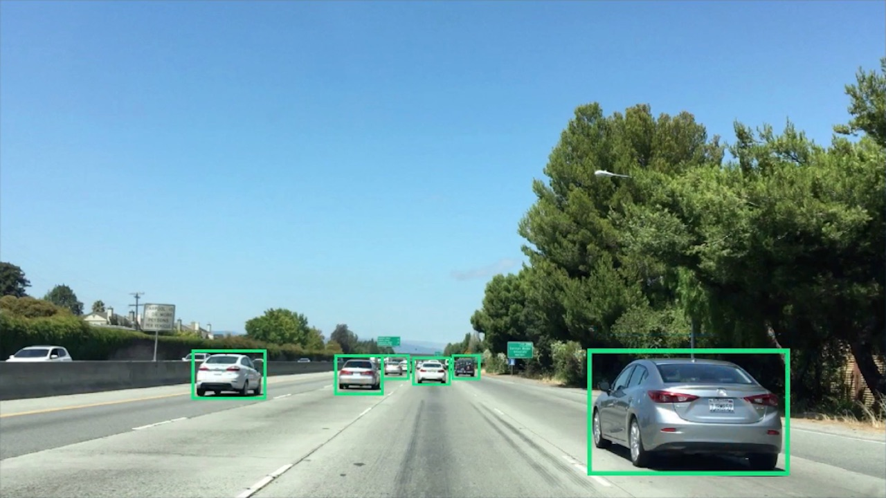

**In this project, the goal is to write a software pipeline to detect vehicles in a video.**

**The goal of this project is as follows:**
1. Train a classifer to predict if a car is present or not.
2. Implement a sliding-window technique and use your trained classifier to search for vehicles in images.
3. Run your pipeline on a video stream (start with the test_video.mp4 and later implement on full project_video.mp4) and create a heat map of recurring detections frame by frame to reject outliers and follow detected vehicles.
4. Estimate a bounding box for vehicles detected.

## Vehicle Detection using Support Vector Machines (SVM)

### Step 1: Data Collection and Organization

To begin the project, I started with Perform a Histogram of Oriented
Gradients (HOG) feature extraction on a labeled training set of images and train a classifier Linear SVM classifier.

This part of the work is shown in hog_svm_work.html

1. The test images are read and only selected the region where car is most likely to be present, which is the bottom half.

2. Then in order to train a classifier, I had to obtain this data. For this project udacity did provide with labeled data for vehicle and non-vechile. These data came from a combination of the GTI vehicle image database, the KITTI vision benchmark suite, and examples extracted from the project video itself.

3. The data is extracted and organized into lists of vehicles and non-vechicle. Then it is saved into a dictionary and the datasets is saved into hard disk as pickle file.

### Step 2: Feature Extraction

This part of the work is shown in hog_svm_work.html

1. By using three different x and y windows sizes (96, 128, 256) all possible x and y window positions are obtained using ``` slide_window ``` function.

2. Using ``` draw_boxes ``` function, the locations are visualized as shown in Figure 1.

3. ``` extract_features ``` function is called to extract hog features. This function in fact calls ```bin_spatial```(to compute the spatial features) and ``` get_hog_features ``` (to compute the hog features). These feature vectors are then appended together. The following are the  parameters I used in order to extract features.

```
color_space = 'HSV'
orient = 12 
pix_per_cell = 8
cell_per_block = 2
hog_channel = 1
spatial_size = (16, 16)
hist_bins = 16
```

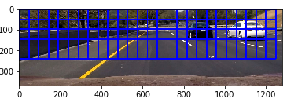
<center><b> Figure 1 </b></center>

### Step 3: Classification

This part of the work is shown in hog_svm_work.html

1. The extracted features are pre-processed using the skelarn's preprocessing module, which provides the function called ``` StandardScaler ```, which computes the mean and standard deviation. Then the training set is scaled using ```scaler.transform()```

2. Using the sklearn package, SVM function ``` LinearSVC() ``` is used to compute the SVM model using the training set.

3. In order to extract features from a single test images ``` single_img_features ``` function is used.

4. Function ``` search_windows ```  is used search through the generated windows and returns the windows, which svm classification returned true for the presence of car.

### Step 4: Dealing with Duplicates and False Positives

This part of the work is shown in hog_svm_work.html

1. The function ``` add_heat ``` creates a heat image of the each final windows.

2. Then ``` apply_threshold ``` function along with a threshold value is used to remove false positives.

3. The ``` scipy.ndimage.measurements.label ``` is used to label features in an array. Then ``` draw_labeled_bboxes ``` outputs the final output image as shown in figure 2.

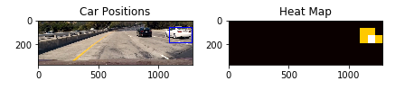
<center><b> Figure 2 </b></center>

## Analysis

As shown in the figure 2, the algorithm clearly misses the black car. Figure-3 shows that even after performing multiple window extraction, the algorithm was clearly missing the car. Also as shown in Figure-4, even though there are no cars present, but there is a false positive. I tried fine-tunning the feature extraction parameters to get better results, but was still getting some false matches. Therefore, to try and do better, I implemented a deep learning algorithm called Convolutional Neural Networks (CNN) to get better accuracy.

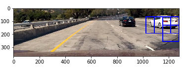
<center><b> Figure 3 </b></center>

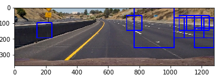
<center><b> Figure 4 </b></center>

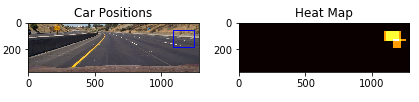
<center><b> Figure 5 </b></center>

## Vehicle Detection using CNN

### Step 1: Data Curation

This part of the work is shown in cnn_work.html

1. The given data was augmented to generate additional data using the keras pre-processing package. This is shown in cell number 10 in cnn_work.ipynb

### Step 2: Model Architecture

The model is exactly the same as the proposed NVIDIA model, but I added a dropout layer before the second last layer, to prevent overfitting and for the model to generalize better. I used this architecture previously for project 3, behaviour cloning and it worked well.

#### Training Process

**Type of optimizer:**
Adaptive Moment Estimation (Adam) Optimizer was to used to optimize the model. The learning rate was set to 0.0001.

**Cost Function:**
Mean Squared Error.

**Batch size:**
I used the batch size of 128.

**Epochs:**
The model was trained for 5 epochs. I found that around 4 or 5 epochs, the validation loss was staying almost constant. Hence, I selected the model to train for 5 epochs.

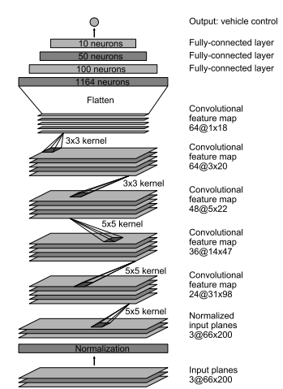
<center><b> Figure 6 </b></center>

### Step 3: Feature Extraction and Classification

This part of the work is shown in cnn_work.html

1. By using three different x and y windows sizes (64, 96, 256) all possible x and y window positions are obtained using ``` slide_window ``` function.

2. Once the CNN extracts the features, classification is done using fully connected layers. 

3. Function ``` search_windows ```  is used search through the generated windows and returns the windows, which the model returned true for the presence of car.

### Step 4: Dealing with Duplicates and False Positives

This part of the work is shown in cnn_work.html

1. Steps are same as before shown above.

## Analysis

As shown in the Figure 7, the model was able to identify the black car unlike the previous method. Figure 1o, is a much more complicated image and the CNN model was able to do a great job in identifying the cars present. Also as shown in Figure-11, it did not give false positive as it did before in Figure 5. Therefore, I implemented the CNN model as my feature extraction and classification method for the final pipeline.

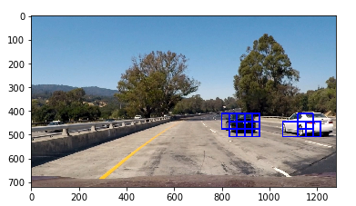
<center><b> Figure 7 </b></center>

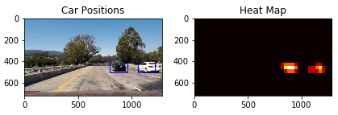
<center><b> Figure 8 </b></center>

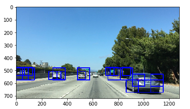
<center><b> Figure 9 </b></center>

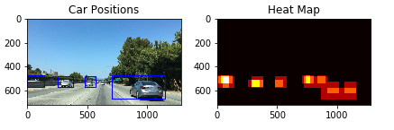
<center><b> Figure 10 </b></center>

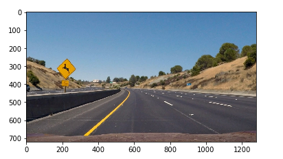
<center><b> Figure 11 </b></center>

## Pipeline

**This work is shown in pipeline.html**

1. Get each frame in the video.
2. For each frame windows of three different sizes are generated using ``` sliding window ``` function. When calling the function, ``` y_start_stop ``` parameter was set to different y values. This was done in order to prevent the window aimlessly searching through the entire image at different scales increasing computational cost. An example would be that smaller window sizes are for futher away vehicles, hence the need to restrict the search space.
3. Pass the generated windows through ```search_windows``` function to predict in which windows the car is present.
4. If there are no predictions the frame in directly appended to the ouput frame. Otherwise the resulting predictions were passed through ```final_output ``` to avoid duplicates and false positives.

## Discussion and Future Work

As explained earlier, I choose to implement a deep learning model based pipeline to achieve higher accuracy and less false postive matches. This method does outperform the linear SVM method, but by far is not perfect. This model would clearly fail, in the presence of faster moving objects and occulsions. One reason could be due to less number of training examples. Also, For Future work, I would like to integrate the lane finding algorithm into this project and also improve the pipeline functions to give much more steady detection and tracking. Also, train and modify the CNN network on much more training data to increase its robustness.
