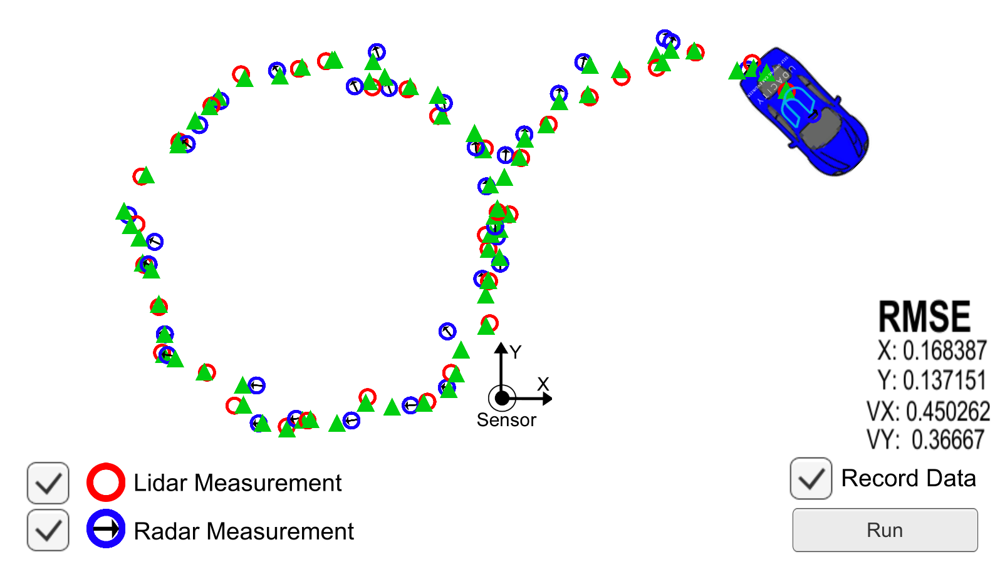
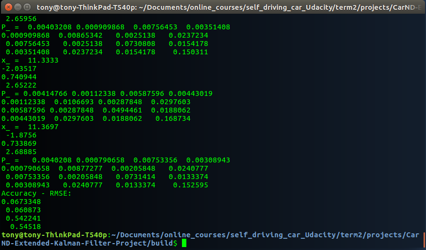
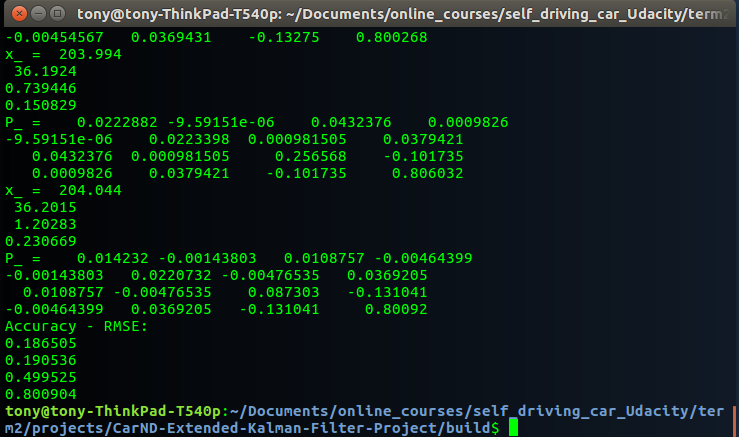

## Extended Kalman Filters

### Output for dataset 1:

###  Output for dataset 2:

This dataset was a bit tricky because the starting lidar measurements for x, y are both zero, and this special case can create problems for both the EKF and UKF lidar update states, in particular for the EKF when calculating the Jacobian. Therefore, the code checks  if thepx and py values are both zeros. If that is the case then, it skips the update step.

