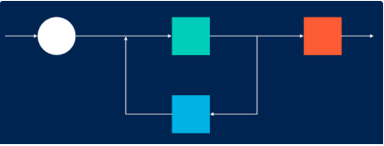

# PID-control


---

## Dependencies

* cmake >= 3.5
 * All OSes: [click here for installation instructions](https://cmake.org/install/)
* make >= 4.1
  * Linux: make is installed by default on most Linux distros
  * Mac: [install Xcode command line tools to get make](https://developer.apple.com/xcode/features/)
  * Windows: [Click here for installation instructions](http://gnuwin32.sourceforge.net/packages/make.htm)
* gcc/g++ >= 5.4
  * Linux: gcc / g++ is installed by default on most Linux distros
  * Mac: same deal as make - [install Xcode command line tools]((https://developer.apple.com/xcode/features/)
  * Windows: recommend using [MinGW](http://www.mingw.org/)
* [uWebSockets](https://github.com/uWebSockets/uWebSockets)
  * Run either `./install-mac.sh` or `./install-ubuntu.sh`.
  * If you install from source, checkout to commit `e94b6e1`, i.e.
    ```
    git clone https://github.com/uWebSockets/uWebSockets 
    cd uWebSockets
    git checkout e94b6e1
    ```
    Some function signatures have changed in v0.14.x. See [this PR](https://github.com/udacity/CarND-MPC-Project/pull/3) for more details.
* Simulator. You can download these from the [project intro page](https://github.com/udacity/self-driving-car-sim/releases) in the classroom.

## Basic Build Instructions

1. Clone this repo.
2. Make a build directory: `mkdir build && cd build`
3. Compile: `cmake .. && make`
4. Run it: `./pid`. 

## Output


## Reflection

###Effect of the P, I, D component of the PID algorithm
1. Proportional term P, accounts for the present values. If only P is used then the car will try to maintain its path but oscillates. The oscillations depends on the control parameter Kp. If Kp is large, the frequency of oscillations increased. As the term was brought down to a lower value, we got much stable drive at least on straight roads.


2. Integral term I, accounts for all the past errors. This term helps in long run , that if output is not strong enough then this value will force for a stronger action. For this project, this term was not really necessary, but setting this term to smaller value resulted in some improved stability.


3. Derivative term D, accounts for the rate of error change between time steps. Introducing this term helped improve the stability of the car and prevent oscillations. Also helped the car navigate curved roads better. A larger value of the Kd resulted in a more stable driving but also causes car quickly turn the wheels to correct its position. This sudden jerk can be uncomfortable for human beings.

### Parameter Tunning
The hyperparameters (P, I, D coefficients) was selected using manual tuning.

